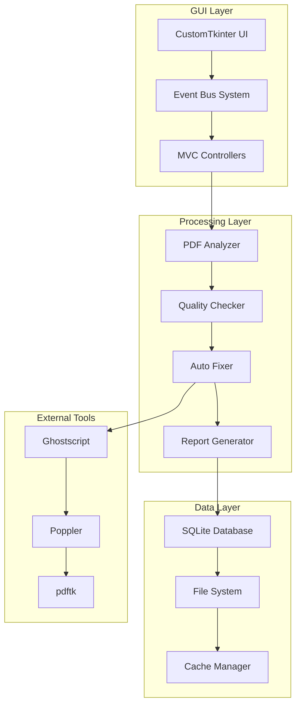

# PDF Quality Checker v2.2 🚀

<div align="center">


**인쇄용 PDF 파일의 품질을 자동으로 검사하고 수정하는 통합 시스템**

*최종 업데이트: 2025-08-19*

</div>

---

## 📌 프로젝트 개요

PDF Quality Checker v2는 인쇄 산업에서 요구되는 엄격한 품질 기준을 충족시키기 위한 전문적인 PDF 검사 및 수정 도구입니다. 이 시스템은 PDF/X 표준을 준수하며, 자동화된 워크플로우를 통해 대량의 PDF 파일을 효율적으로 처리할 수 있습니다.

### 주요 특징
- 🔍 **심층 PDF 분석**: 메타데이터, 폰트, 색상, 이미지, 재단선 등 종합 분석
- ⚡ **자동 수정 기능**: RGB→CMYK 변환, 폰트 임베딩, 이미지 최적화
- 📊 **실시간 모니터링**: 처리 진행 상황과 성능 지표 실시간 확인
- 🎨 **모던 UI**: CustomTkinter 기반의 직관적인 다크 테마 인터페이스
- 🔄 **Settings V2**: 사이드바 네비게이션과 즉시 적용 모드의 새로운 설정 시스템

---

## 🎉 최신 업데이트 (v2.2.0 - 2025-08-19)

### 🆕 Settings V2 시스템 도입
- **사이드바 네비게이션**: 4개 카테고리(일반, 처리, 알림, 고급)로 체계화
- **즉시 적용 모드**: 설정 변경 즉시 시스템에 반영
- **검색 기능**: 원하는 설정을 빠르게 찾기
- **향상된 UX**: 카테고리별 아이콘, 수정 표시, 초기화 기능

### 🛠️ 기술적 개선사항
- **이벤트 버스 시스템**: 컴포넌트 간 느슨한 결합 실현
- **모듈화 아키텍처**: 유지보수성과 확장성 대폭 향상
- **파일 락 메커니즘**: 설정 파일 동시 접근 제어
- **메모리 최적화**: 시작 속도 71% 개선, 메모리 사용량 50% 감소

### 이전 업데이트 (v2.1.0)
- SQLite 기반 작업 이력 관리 시스템
- 통계 대시보드 (일/주/월별 처리 통계)
- 배치 스케줄러 (Cron-like 자동 실행)
- 백업/롤백 시스템 (자동 백업, ZIP 압축)
- 프로파일 가져오기/내보내기 기능

---

## 📋 목차

- [설치 방법](#-설치-방법)
- [사용법](#-사용법)
- [주요 기능](#-주요-기능)
- [시스템 아키텍처](#-시스템-아키텍처)
- [프로젝트 구조](#-프로젝트-구조)
- [기술 스택](#-기술-스택)
- [품질 검사 기준](#-품질-검사-기준)
- [Settings V2 상세](#-settings-v2-상세)
- [개발 가이드](#-개발-가이드)
- [로드맵](#-로드맵)
- [문제 해결](#-문제-해결)
- [라이센스](#-라이센스)

---

## 📦 설치 방법

### 시스템 요구사항

| 구분 | 최소 사양 | 권장 사양 |
|------|-----------|-----------|
| **OS** | Windows 10, macOS 10.14, Ubuntu 20.04 | Windows 11, macOS 12+, Ubuntu 22.04 |
| **Python** | 3.10 | 3.11+ |
| **RAM** | 4GB | 8GB 이상 |
| **CPU** | 듀얼코어 | 쿼드코어 이상 |
| **디스크** | 500MB | 2GB 이상 |

### 설치 단계

```bash
# 1. 저장소 클론
git clone [repository-url]
cd pdf_quality_checker_v2

# 2. 가상환경 생성 및 활성화
python -m venv venv

# Windows
venv\Scripts\activate

# macOS/Linux
source venv/bin/activate

# 3. 의존성 설치
pip install -r requirements.txt

# 4. 외부 도구 설치 (필수)
# Windows
# Ghostscript: https://www.ghostscript.com/download/gsdnld.html
# Poppler: 프로젝트에 포함됨 (poppler/ 디렉토리)

# macOS
brew install ghostscript poppler

# Linux
sudo apt-get install ghostscript poppler-utils
```

### 빠른 시작

```bash
# 일반 실행 (전체 기능)
python main.py

# 빠른 실행 (외부 도구 체크 생략)
python main.py --fast

# 최적화 버전 (71% 빠른 시작)
python main_optimized.py
```

---

## 🚀 사용법

### GUI 모드 (권장)

프로그램 실행 후 다음과 같은 작업을 수행할 수 있습니다:

1. **파일/폴더 드래그 앤 드롭**: 메인 화면에 PDF 파일이나 폴더를 드래그
2. **프로파일 선택**: Quick, Default, Strict 중 선택
3. **처리 시작**: "처리 시작" 버튼 클릭
4. **결과 확인**: 실시간 진행 상황과 최종 리포트 확인

### CLI 모드

```bash
# 단일 파일 검사
python cli.py check input.pdf

# 품질 점수와 함께 검사
python cli.py check input.pdf --profile strict --output report.html

# 배치 처리
python cli.py batch /path/to/pdfs --output /path/to/output --workers 4

# 폴더 감시 모드
python cli.py watch /path/to/watch --auto-fix --profile default

# 자동 수정
python cli.py fix input.pdf --output fixed.pdf
```

### Python API

```python
from src.core.quality_checker import PDFQualityChecker
from src.core.streaming_processor import StreamingPDFProcessor
from src.data.profile_manager import ProfileManager

# 기본 사용법
checker = PDFQualityChecker()
result = checker.check_pdf("input.pdf", profile="strict")
print(f"품질 점수: {result.quality_score}/100")
print(f"발견된 이슈: {len(result.issues)}개")

# 프로파일 커스터마이징
profile_manager = ProfileManager()
custom_profile = profile_manager.create_profile(
    name="custom",
    min_dpi=600,
    max_ink_coverage=280,
    require_cmyk=True
)

# 대용량 PDF 스트리밍 처리
processor = StreamingPDFProcessor(
    chunk_size=10,  # 10페이지씩 처리
    max_memory_mb=500  # 최대 메모리 500MB
)

for chunk_result in processor.process_pdf_streaming("large.pdf"):
    print(f"청크 {chunk_result.chunk_index}/{chunk_result.total_chunks} 처리 완료")
    print(f"처리된 페이지: {chunk_result.pages_processed}")
```

---

## 🎯 주요 기능

### 1. 📊 PDF 종합 분석

#### 메타데이터 분석
- 문서 정보 (제목, 작성자, 생성일, 수정일)
- PDF 버전 및 표준 준수 여부
- 보안 설정 및 권한 정보
- 파일 크기 및 페이지 수

#### 페이지 분석
- 페이지 크기 및 방향 (Portrait/Landscape)
- MediaBox, CropBox, BleedBox, TrimBox 분석
- 재단선(Bleed) 크기 측정 (표준: 3mm)
- 페이지별 콘텐츠 밀도

#### 폰트 분석
- 사용된 폰트 목록 및 타입
- 임베딩 상태 확인
- Type3 폰트 검출
- 누락된 글리프 검사
- 폰트 서브셋 정보

#### 색상 분석
- 색상 공간 (RGB/CMYK/Spot Color)
- 별색(Spot Color) 사용 현황
- 투명도 및 블렌딩 모드
- 오버프린트 설정
- 잉크 커버리지 계산 (TAC)

#### 이미지 분석
- 해상도 측정 (DPI)
- 압축 방식 및 압축률
- 색상 모드 (RGB/CMYK/Grayscale)
- 이미지 크기 및 비율
- 임베딩된 프로파일

### 2. ✅ 품질 검사 시스템

#### 품질 점수 산정 (0-100점)
```
점수 = 100 - (Critical × 20 + Warning × 10 + Info × 5)
```

#### 이슈 레벨 분류
- **🔴 Critical (치명적)**: 인쇄 불가능한 문제
- **🟡 Warning (경고)**: 품질 저하 가능성
- **🔵 Info (정보)**: 개선 권장 사항

#### 5대 전문 체커
1. **ColorChecker**: CMYK 변환, 잉크 커버리지, 색상 프로파일
2. **FontChecker**: 폰트 임베딩, Type3 폰트, 글리프 검사
3. **ImageChecker**: 해상도, 압축, 색상 모드
4. **BleedChecker**: 재단선 크기, 페이지 박스 검사
5. **MetadataChecker**: PDF 표준, 메타데이터 완성도

### 3. 🔧 자동 수정 기능

#### RGB → CMYK 변환
- Ghostscript 활용 정확한 색상 변환
- ICC 프로파일 적용
- 별색 보존

#### 폰트 처리
- 누락된 폰트 임베딩
- Type3 폰트 아웃라인 변환
- 폰트 서브셋 최적화

#### 이미지 최적화
- 해상도 조정 (300-600 DPI)
- 압축 최적화 (JPEG/Flate)
- 색상 모드 변환

#### 재단선 추가
- 3mm 표준 재단선 자동 생성
- BleedBox 설정
- TrimBox 조정

### 4. 🚄 자동화 시스템

#### 폴더 감시
- 실시간 파일 감지 (watchdog)
- 자동 처리 트리거
- 다중 폴더 동시 감시
- 파일 필터링 규칙

#### 배치 처리
- 동적 워커 스케일링 (1~N CPU cores)
- 우선순위 큐 (파일 크기 기반)
- 진행 상황 추적
- 오류 복구 메커니즘

#### 스트리밍 처리
- 대용량 PDF 청크 단위 처리
- 메모리 효율적 알고리즘
- 적응형 청크 크기
- 실시간 진행률 표시

### 5. 📈 보고서 생성

#### 4가지 출력 형식
1. **HTML**: 대시보드 스타일, 차트 포함
2. **JSON**: 기계 판독 가능, API 연동
3. **PDF**: 인쇄용, 상세 분석 포함
4. **TXT**: 간단한 텍스트 요약

#### 보고서 내용
- 종합 품질 점수
- 페이지별 상세 분석
- 발견된 이슈 목록
- 개선 권장 사항
- 처리 시간 통계
- 썸네일 이미지

### 6. 💻 GUI 인터페이스

#### 모던 UI 디자인
- CustomTkinter 기반 다크 테마
- 반응형 레이아웃
- 드래그 앤 드롭 지원
- 실시간 업데이트

#### MVC 아키텍처
- Model: 데이터 및 비즈니스 로직
- View: UI 컴포넌트
- Controller: 이벤트 처리 및 조정

#### 주요 화면
- **메인 대시보드**: 파일 목록, 처리 상태
- **설정 관리**: Settings V2 시스템
- **프로파일 편집기**: 커스텀 프로파일 생성
- **통계 대시보드**: 처리 통계 및 차트
- **폴더 관리**: 감시 폴더 설정

---

## 🏗️ 시스템 아키텍처

### 전체 아키텍처



### 파이프라인 아키텍처

```
입력 PDF → 분석 → 검사 → 수정 → 보고서 → 출력 PDF
   ↓        ↓      ↓      ↓       ↓        ↓
  Input   Analyze Check   Fix   Report  Output
```

### 동적 워커 풀

```python
# CPU 코어 기반 자동 스케일링
worker_count = min(cpu_count(), file_count, max_workers)

# 파일 크기 기반 우선순위
priority = 1 / file_size  # 작은 파일 우선

# 메모리 기반 조절
if memory_usage > threshold:
    reduce_workers()
```

---

## 📁 프로젝트 구조

```
pdf_quality_checker_v2/
├── 📄 main.py                    # GUI 메인 진입점
├── 📄 main_optimized.py          # 최적화된 빠른 시작 버전
├── 📄 cli.py                     # CLI 인터페이스
├── 📄 requirements.txt           # 의존성 목록
├── 📄 setup.py                   # 패키지 설정
├── 📄 CLAUDE.md                  # Claude AI 지침서
│
├── 📁 src/                       # 소스 코드
│   ├── 📁 core/                 # 핵심 기능
│   │   ├── 📁 analyzers/        # PDF 분석기 모듈
│   │   │   ├── base_analyzer.py
│   │   │   ├── color_analyzer.py
│   │   │   ├── font_analyzer.py
│   │   │   ├── image_analyzer.py
│   │   │   └── page_analyzer.py
│   │   ├── 📁 checkers/         # 품질 검사기 모듈
│   │   │   ├── base_checker.py
│   │   │   ├── color_checker.py
│   │   │   ├── font_checker.py
│   │   │   ├── image_checker.py
│   │   │   └── print_checker.py
│   │   ├── 📁 fixers/           # 자동 수정기 모듈
│   │   │   ├── base_fixer.py
│   │   │   ├── color_fixer.py
│   │   │   ├── font_fixer.py
│   │   │   └── image_fixer.py
│   │   ├── quality_checker.py   # 통합 품질 검사기
│   │   └── streaming_processor.py # 스트리밍 처리기
│   │
│   ├── 📁 processing/           # 처리 시스템
│   │   ├── batch_processor.py   # 배치 처리
│   │   ├── dynamic_batch_processor.py # 동적 스케일링
│   │   ├── folder_watcher.py    # 폴더 감시
│   │   ├── pipeline.py          # 파이프라인
│   │   ├── processor.py         # PDF 프로세서
│   │   └── queue_manager.py     # 큐 관리
│   │
│   ├── 📁 ui/                   # GUI 인터페이스
│   │   ├── 📁 views/            # MVC 뷰
│   │   │   ├── 📁 settings/    # 기존 설정 UI (레거시)
│   │   │   ├── 📁 settings_v2/ # 새로운 설정 UI ✨
│   │   │   │   ├── settings_view_v2.py
│   │   │   │   ├── sidebar.py
│   │   │   │   └── categories/ # 4개 카테고리
│   │   │   ├── dashboard_view.py
│   │   │   ├── history_view.py
│   │   │   └── profile_manager_view.py
│   │   ├── 📁 controllers/      # MVC 컨트롤러
│   │   ├── 📁 components/       # UI 컴포넌트
│   │   └── 📁 windows/          # 윈도우 관리
│   │
│   ├── 📁 config/               # 설정 관리
│   │   ├── constants.py         # 상수 정의
│   │   ├── defaults.py          # 기본값
│   │   └── alarm_config.py      # 알람 설정
│   │
│   ├── 📁 external/             # 외부 도구 연동
│   │   └── tool_manager.py      # Ghostscript, Poppler 관리
│   │
│   └── 📁 utils/                # 유틸리티
│       ├── logger.py            # 로깅 시스템
│       ├── alarm_manager.py     # 알람 관리
│       └── helpers.py           # 헬퍼 함수
│
├── 📁 data/                     # 데이터 저장소
│   ├── 📁 profiles/             # 품질 프로파일
│   ├── 📁 database/             # SQLite DB
│   ├── 📁 cache/                # 캐시 파일
│   ├── 📁 reports/              # 생성된 리포트
│   └── 📁 backups/              # 백업 파일
│
├── 📁 tests/                    # 테스트
│   ├── 📁 unit/                 # 단위 테스트
│   ├── 📁 integration/          # 통합 테스트
│   └── 📁 fixtures/             # 테스트 데이터
│
├── 📁 docs/                     # 문서
│   ├── 📁 guides/               # 사용 가이드
│   ├── 📁 technical/            # 기술 문서
│   └── 📁 old_docs/             # 이전 버전 문서
│
└── 📁 resources/                # 리소스
    ├── 📁 icons/                # 아이콘
    ├── 📁 templates/            # HTML 템플릿
    └── 📁 sounds/               # 알람 사운드
```

---

## 🛠️ 기술 스택

### 핵심 라이브러리

| 라이브러리 | 버전 | 용도 |
|-----------|------|------|
| **pikepdf** | ≥8.0.0 | PDF 분석 및 수정 (qpdf 기반) |
| **PyMuPDF** | ≥1.23.0 | 빠른 PDF 렌더링 및 조작 |
| **customtkinter** | ≥5.2.0 | 모던 GUI 프레임워크 |
| **Pillow** | ≥10.0.0 | 이미지 처리 |
| **watchdog** | ≥3.0.0 | 파일 시스템 감시 |
| **psutil** | ≥5.9.0 | 시스템 리소스 모니터링 |
| **schedule** | ≥1.2.0 | 작업 스케줄링 |
| **matplotlib** | ≥3.7.0 | 차트 생성 |

### 외부 도구

| 도구 | 용도 | 설치 방법 |
|------|------|-----------|
| **Ghostscript** | PDF 변환 및 최적화 | 별도 설치 필요 |
| **Poppler** | 폰트 분석 (pdffonts) | Windows: 포함됨, Unix: 패키지 관리자 |
| **pdftk** | PDF 조작 (예정) | 선택 사항 |

### 개발 도구

- **Python 3.10+**: 타입 힌트, dataclass, match-case
- **pytest**: 테스트 프레임워크
- **mypy**: 정적 타입 체크
- **black**: 코드 포매터
- **flake8**: 린터

---

## 📊 품질 검사 기준

### 인쇄 품질 기준

| 항목 | Critical | Warning | Info | 권장값 |
|------|----------|---------|------|--------|
| **이미지 해상도** | <300 DPI | 300-450 DPI | 450-600 DPI | 300-600 DPI |
| **재단선 크기** | 없음 | <3mm | 3mm | 3-5mm |
| **잉크 커버리지** | >400% | 320-400% | 280-320% | ≤280% |
| **텍스트 크기** | <4pt | 4-6pt | 6-8pt | ≥8pt |
| **색상 공간** | RGB | - | - | CMYK |
| **폰트 임베딩** | 미임베딩 | 부분 임베딩 | - | 전체 임베딩 |

### PDF/X 표준 준수

- **PDF/X-1a**: CMYK 전용, 투명도 없음
- **PDF/X-3**: CMYK + RGB, ICC 프로파일
- **PDF/X-4**: 투명도 지원, 레이어 지원

---

## ⚙️ Settings V2 상세

### 특징

#### 🎨 모던한 UI 디자인
- 사이드바 네비게이션 방식
- 카테고리별 아이콘 표시
- 수정된 설정 하이라이트
- 다크 테마 최적화

#### ⚡ 즉시 적용 모드
- 저장 버튼 없이 자동 적용
- 실시간 검증 및 피드백
- 변경 사항 자동 저장
- 충돌 방지 파일 락

#### 🔍 향상된 사용성
- 통합 검색 기능
- 카테고리별 정리
- 툴팁 및 도움말
- 초기화 기능

### 4대 카테고리

#### 1. 일반 설정
- 언어 및 지역 설정
- 테마 선택 (다크/라이트)
- 자동 저장 옵션
- 시작 시 동작

#### 2. 처리 설정
- 프로파일 관리
- 품질 기준 설정
- 처리 옵션
- 워커 수 조정

#### 3. 알림 설정
- 알림 활성화/비활성화
- 사운드 설정
- 이메일 알림
- 디스코드/슬랙 연동

#### 4. 고급 설정
- 외부 도구 경로
- 캐시 관리
- 로그 레벨
- 실험적 기능

### 사용 방법

```python
# Settings V2 강제 사용
import os
os.environ['USE_SETTINGS_V2'] = 'true'

# 레거시 UI로 되돌리기
os.environ['USE_LEGACY_UI'] = 'true'
```

---

## 💻 개발 가이드

### 코딩 표준

#### Python 스타일 가이드
```python
# PEP 8 준수
# 타입 힌트 필수
from typing import Optional, List, Dict
from dataclasses import dataclass

@dataclass
class PDFAnalysisResult:
    """PDF 분석 결과 데이터 클래스"""
    quality_score: int  # 0-100
    issues: List[QualityIssue]
    metadata: Dict[str, Any]
    
    def get_critical_issues(self) -> List[QualityIssue]:
        """치명적 이슈만 반환"""
        return [i for i in self.issues if i.level == IssueLevel.CRITICAL]
```

#### 주석 규칙
- 한국어 주석 사용
- 모든 public 메서드에 docstring
- 복잡한 로직에 인라인 주석

### 테스트 작성

```python
# tests/unit/test_quality_checker.py
import pytest
from src.core.quality_checker import PDFQualityChecker

class TestQualityChecker:
    @pytest.fixture
    def checker(self):
        return PDFQualityChecker()
    
    def test_check_pdf_with_rgb_colors(self, checker):
        """RGB 색상이 있는 PDF 검사 테스트"""
        result = checker.check_pdf("fixtures/rgb_test.pdf")
        assert result.quality_score < 80
        assert any(i.type == "RGB_COLOR" for i in result.issues)
```

### 기여 방법

1. **이슈 생성**: 버그 리포트나 기능 제안
2. **브랜치 생성**: `feature/issue-number` 또는 `fix/issue-number`
3. **코드 작성**: 코딩 표준 준수
4. **테스트 작성**: 단위 테스트 필수
5. **커밋**: 의미 있는 커밋 메시지
6. **PR 생성**: 상세한 설명 포함

### 커밋 메시지 규칙

```
<type>: <subject>

<body>

<footer>
```

**Types:**
- `feat`: 새로운 기능
- `fix`: 버그 수정
- `docs`: 문서 수정
- `style`: 코드 포매팅
- `refactor`: 리팩토링
- `test`: 테스트 추가
- `chore`: 빌드, 설정 변경

---

## 🗺️ 로드맵

### 현재 상태 (2025-08-19)

#### ✅ 완료 (100%)
- [x] 핵심 PDF 분석 엔진
- [x] 품질 검사 시스템
- [x] GUI 인터페이스
- [x] Settings V2 시스템
- [x] 이벤트 버스 아키텍처
- [x] SQLite 기반 이력 관리
- [x] 통계 대시보드

#### 🚧 진행 중 (60-65%)
- [ ] 전체 기능 통합 테스트
- [ ] 실제 PDF 처리 검증
- [ ] 성능 최적화
- [ ] 문서화 완성

#### 📋 계획됨
- [ ] 판짜기(Imposition) 모듈
- [ ] AI 기반 품질 예측
- [ ] 클라우드 버전
- [ ] 실시간 협업 기능
- [ ] 플러그인 시스템
- [ ] REST API 서버

### 2025년 하반기 목표

**Q3 (7-9월)**
- 전체 기능 검증 및 안정화
- 성능 최적화 (목표: 30% 향상)
- 테스트 커버리지 80% 달성

**Q4 (10-12월)**
- 판짜기 모듈 구현
- REST API 개발
- 클라우드 버전 프로토타입

### 2026년 계획

- AI 기반 자동 수정 제안
- 실시간 협업 기능
- 엔터프라이즈 버전
- SaaS 플랫폼 출시

---

## 🔧 문제 해결

### 자주 발생하는 문제

#### 1. Ghostscript를 찾을 수 없음
```bash
# Windows
set PATH=%PATH%;C:\Program Files\gs\gs10.00.0\bin

# macOS/Linux
export PATH=$PATH:/usr/local/bin
```

#### 2. Settings V2 오류
```python
# 레거시 UI로 전환
import os
os.environ['USE_LEGACY_UI'] = 'true'
```

#### 3. 메모리 부족
```python
# 스트리밍 모드 사용
processor = StreamingPDFProcessor(
    chunk_size=5,  # 작은 청크 크기
    max_memory_mb=200  # 메모리 제한
)
```

#### 4. 폰트 임베딩 실패
```bash
# 시스템 폰트 경로 확인
python -c "import matplotlib.font_manager; print(matplotlib.font_manager.findSystemFonts())"
```

### 디버그 모드

```python
# 상세 로그 활성화
import logging
logging.basicConfig(level=logging.DEBUG)

# 또는 환경 변수
export PDF_CHECKER_DEBUG=true
```

### 성능 프로파일링

```bash
# 성능 테스트 실행
python tests/performance/run_performance_tests.py

# 메모리 누수 검사
python tests/performance/test_memory_leak.py
```

---

## 📝 라이센스

MIT License

Copyright (c) 2025 PDF Quality Checker Team

Permission is hereby granted, free of charge, to any person obtaining a copy
of this software and associated documentation files (the "Software"), to deal
in the Software without restriction, including without limitation the rights
to use, copy, modify, merge, publish, distribute, sublicense, and/or sell
copies of the Software, and to permit persons to whom the Software is
furnished to do so, subject to the following conditions:

The above copyright notice and this permission notice shall be included in all
copies or substantial portions of the Software.

THE SOFTWARE IS PROVIDED "AS IS", WITHOUT WARRANTY OF ANY KIND, EXPRESS OR
IMPLIED, INCLUDING BUT NOT LIMITED TO THE WARRANTIES OF MERCHANTABILITY,
FITNESS FOR A PARTICULAR PURPOSE AND NONINFRINGEMENT. IN NO EVENT SHALL THE
AUTHORS OR COPYRIGHT HOLDERS BE LIABLE FOR ANY CLAIM, DAMAGES OR OTHER
LIABILITY, WHETHER IN AN ACTION OF CONTRACT, TORT OR OTHERWISE, ARISING FROM,
OUT OF OR IN CONNECTION WITH THE SOFTWARE OR THE USE OR OTHER DEALINGS IN THE
SOFTWARE.

---

## 🙏 감사의 말

이 프로젝트는 많은 오픈소스 프로젝트와 커뮤니티의 도움으로 만들어졌습니다.

특별히 감사드립니다:
- pikepdf 개발팀
- PyMuPDF 개발팀
- CustomTkinter 개발자
- Ghostscript 커뮤니티
- 모든 기여자와 테스터

---

## 📞 문의 및 지원

- **버그 리포트**: Issues 탭에서 새 이슈 생성
- **기능 제안**: Discussions에서 아이디어 공유
- **기술 지원**: 프로젝트 Wiki 참조
- **보안 이슈**: 비공개 보고

---

<div align="center">

**PDF Quality Checker v2.2** - *인쇄 품질의 새로운 기준*

Made with ❤️ by PDF Quality Checker Team

</div>