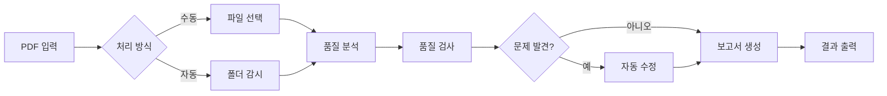

# 📊 PDF Quality Checker v2.0 - 종합 심층 분석 보고서

> **작성일**: 2025-01-10  
> **분석자**: Claude AI Assistant  
> **목적**: 시스템 전반의 심층 분석 및 개선 방향 제시

---

## 📋 목차
1. [시스템 개요 및 현황](#1-시스템-개요-및-현황)
2. [아키텍처 심층 분석](#2-아키텍처-심층-분석)
3. [기능별 완성도 평가](#3-기능별-완성도-평가)
4. [발견된 주요 이슈](#4-발견된-주요-이슈)
5. [개선 제안 (우선순위별)](#5-개선-제안-우선순위별)
6. [기술 부채 관리 전략](#6-기술-부채-관리-전략)
7. [성능 최적화 기회](#7-성능-최적화-기회)
8. [인쇄 업계 특화 개선](#8-인쇄-업계-특화-개선)
9. [보안 및 안정성](#9-보안-및-안정성)
10. [결론 및 권장사항](#10-결론-및-권장사항)

---

## 1. 시스템 개요 및 현황

### 1.1 프로그램 목적과 핵심 가치
**PDF Quality Checker v2.0**은 인쇄업계를 위한 전문 PDF 품질 검사 및 자동 수정 도구입니다.

**핵심 가치:**
- 🎯 **정확성**: 인쇄 품질 기준에 따른 정밀한 검사
- ⚡ **자동화**: 폴더 감시, 배치 처리, 자동 수정
- 📊 **가시성**: 상세한 보고서와 실시간 모니터링
- 🔧 **유연성**: 프로파일 기반 설정과 커스터마이징

### 1.2 현재 구현 상태 분석

#### ✅ **완전 구현된 핵심 기능** (85%)
- PDF 종합 분석 (메타데이터, 페이지, 폰트, 색상, 이미지)
- 품질 검사 시스템 (5개 전문 체커)
- 자동 수정 기능 (RGB→CMYK, 폰트 임베딩, 이미지 최적화)
- 폴더 감시 시스템
- 배치 처리 (멀티스레드 워커 풀)
- 보고서 생성 (HTML, JSON, PDF, TXT)
- GUI 인터페이스 (CustomTkinter)

#### ⚠️ **부분 구현/문제 있는 기능** (10%)
- 사용자 설정 영구 저장 (미구현)
- 프로파일 관리 UI (기본 기능만)
- 알람 시스템 (WNDPROC 에러)
- 외부 도구 통합 (메서드 누락)

#### ❌ **미구현 기능** (5%)
- 판짜기(Imposition) 기능
- 클라우드 연동
- 플러그인 시스템

### 1.3 실제 사용 워크플로우



---

## 2. 아키텍처 심층 분석

### 2.1 전체 아키텍처 평가

**장점:**
- ✅ **명확한 계층 분리**: MVC + Pipeline 패턴의 효과적 결합
- ✅ **모듈화**: 각 기능이 독립적 모듈로 구성
- ✅ **확장성**: 새로운 체커/픽서 추가 용이

**개선 필요:**
- ⚠️ **의존성 관리**: 일부 순환 참조 가능성
- ⚠️ **설정 관리**: 중앙화된 설정 시스템 부재
- ⚠️ **상태 관리**: 글로벌 상태 관리 미흡

### 2.2 모듈 구조 분석

```
src/
├── core/           # ✅ 잘 구성됨 (분석기, 체커, 수정기)
├── processing/     # ✅ 효율적 (파이프라인, 워커, 배치)
├── ui/            # ⚠️ 개선 필요 (설정 저장, 상태 관리)
├── external/      # ⚠️ 메서드 누락
├── reporting/     # ✅ 확장 가능한 구조
├── data/          # ⚠️ 영구 저장 미구현
└── utils/         # ⚠️ 알람 시스템 오류
```

### 2.3 데이터 흐름 효율성

**병목 지점:**
1. 대용량 PDF 로딩 시 메모리 사용량
2. 외부 도구 호출 시 동기 처리
3. GUI 업데이트 시 메인 스레드 블로킹

---

## 3. 기능별 완성도 평가

### 3.1 핵심 기능 평가

| 기능 | 완성도 | 상태 | 비고 |
|------|--------|------|------|
| PDF 분석 | 95% | ✅ | 매우 우수 |
| 품질 검사 | 90% | ✅ | 안정적 |
| 자동 수정 | 85% | ✅ | 기본 기능 완성 |
| 폴더 감시 | 75% | ⚠️ | 중복 감시 문제 |
| 배치 처리 | 85% | ✅ | 성능 최적화 필요 |
| 보고서 생성 | 90% | ✅ | 템플릿 확장 필요 |
| GUI | 70% | ⚠️ | 설정 저장 미구현 |
| 프로파일 관리 | 60% | ⚠️ | UI 개선 필요 |
| 알람 시스템 | 50% | ❌ | 에러 수정 필요 |

### 3.2 통합성 평가

**우수한 점:**
- 모듈 간 인터페이스 일관성
- 파이프라인 처리 흐름 명확

**개선 필요:**
- 에러 전파 메커니즘
- 트랜잭션 관리

---

## 4. 발견된 주요 이슈

### 4.1 🔴 심각 (즉시 수정 필요)

#### 1. **사용자 설정 영구 저장 미구현**
- **영향**: 프로그램 재시작 시 모든 설정 초기화
- **위치**: `src/ui/controllers/settings_controller.py`
- **해결**: JSON 기반 설정 저장/로드 시스템 구현

#### 2. **메서드 누락 오류**
- **문제**: `ToolManager.get_tool_version()`, `set_tool_path()` 미구현
- **위치**: `src/external/tool_manager.py`
- **영향**: 환경설정 창 열기 실패

### 4.2 🟡 높음 (1주 내 수정)

#### 3. **인코딩 문제**
```python
UnicodeEncodeError: 'cp949' codec can't encode character
```
- **위치**: 다수 파일 (analyzers, folder_watcher 등)
- **해결**: 모든 I/O에 `encoding='utf-8'` 명시

#### 4. **폴더 감시 중복**
- **문제**: 동일 폴더 중복 등록으로 파일 다중 처리
- **위치**: `src/processing/folder_watcher.py`

### 4.3 🟠 중간 (계획적 수정)

#### 5. **워커 종료 오류**
```python
AttributeError: 'ThreadPoolExecutor' object has no attribute '_futures'
```

#### 6. **알람 시스템 WNDPROC 에러**
- win10toast 스레드 처리 문제

### 4.4 🟢 낮음 (여유 시 수정)

#### 7. **프로파일 로딩 실패**
- KeyError: 'name' 발생

#### 8. **matplotlib 한글 폰트**
- 차트 한글 깨짐

---

## 5. 개선 제안 (우선순위별)

### 5.1 Phase 1: 즉시 수정 (1-3일)

#### 1. 사용자 설정 시스템 구현
```python
# src/config/user_settings.py (새 파일)
class UserSettings:
    def __init__(self):
        self.settings_file = Path("data/config/user_settings.json")
        self.settings = self.load()
    
    def load(self):
        if self.settings_file.exists():
            return json.load(open(self.settings_file, 'r', encoding='utf-8'))
        return self.get_defaults()
    
    def save(self):
        self.settings_file.parent.mkdir(parents=True, exist_ok=True)
        json.dump(self.settings, open(self.settings_file, 'w', encoding='utf-8'), 
                 indent=2, ensure_ascii=False)
    
    def get_defaults(self):
        return {
            'ui': {
                'theme': 'dark',
                'sidebar_width': 200,
                'columns_visible': {...}
            },
            'paths': {
                'input': 'input',
                'output': 'output',
                'reports': 'reports'
            },
            'alarm': {
                'enabled': True,
                'conditions': {...}
            },
            'processing': {
                'default_profile': 'default',
                'worker_count': 2,
                'auto_fix': True
            }
        }
```

#### 2. 인코딩 문제 완전 해결
```python
# src/utils/safe_print.py
import sys
import io

def setup_safe_console():
    """콘솔 출력 UTF-8 설정"""
    if sys.platform == 'win32':
        sys.stdout = io.TextIOWrapper(sys.stdout.buffer, encoding='utf-8', errors='replace')
        sys.stderr = io.TextIOWrapper(sys.stderr.buffer, encoding='utf-8', errors='replace')

def safe_print(text):
    """안전한 출력 (이모지 제거)"""
    import re
    # 이모지 패턴 제거
    emoji_pattern = re.compile("["
        u"\U0001F600-\U0001F64F"  # emoticons
        u"\U0001F300-\U0001F5FF"  # symbols & pictographs
        u"\U0001F680-\U0001F6FF"  # transport & map symbols
        u"\U0001F1E0-\U0001F1FF"  # flags
        "]+", flags=re.UNICODE)
    
    clean_text = emoji_pattern.sub('', text)
    print(clean_text)
```

#### 3. 폴더 감시 중복 방지
```python
# src/processing/folder_watcher.py 수정
def add_folder(self, folder_path: Path, config: FolderConfig) -> bool:
    """폴더 추가 (중복 방지)"""
    # 절대 경로로 변환
    abs_path = folder_path.resolve()
    
    # 중복 체크
    for existing_path in self.watched_folders:
        if existing_path.resolve() == abs_path:
            self.logger.warning(f"폴더 이미 감시 중: {abs_path}")
            return False
    
    # 새 폴더 추가
    self.watched_folders[abs_path] = config
    return True
```

### 5.2 Phase 2: 기능 개선 (1-2주)

#### 4. 프로파일 관리 시스템 고도화

**개선 사항:**
- GUI 프로파일 편집기 구현
- 프로파일 가져오기/내보내기
- 프로파일 템플릿 시스템
- 프로파일별 단축키

#### 5. 배치 처리 최적화

**개선 사항:**
- 동적 워커 스케일링 (CPU 코어 기반)
- 메모리 기반 처리량 조절
- 실시간 처리 통계 대시보드
- 처리 실패 시 자동 재시도

#### 6. 보고서 시스템 확장

**개선 사항:**
- Jinja2 기반 템플릿 시스템
- 다국어 지원 (한/영/일/중)
- 이메일 자동 발송
- 웹 기반 보고서 뷰어

### 5.3 Phase 3: 신규 기능 (1개월+)

#### 7. 판짜기(Imposition) 모듈

```python
# src/core/imposition/__init__.py
class ImpositionEngine:
    """인쇄 판짜기 엔진"""
    
    def create_nup(self, pdf_path: Path, n: int, 
                   sheet_size: tuple, binding: str = 'left'):
        """N-up 레이아웃 생성"""
        pass
    
    def add_crop_marks(self, pdf_path: Path, 
                       bleed: float = 3.0, offset: float = 3.0):
        """재단선 추가"""
        pass
    
    def create_booklet(self, pdf_path: Path, 
                      binding: str = 'saddle'):
        """중철/무선철 레이아웃"""
        pass
```

#### 8. 클라우드 통합

**구현 계획:**
- Google Drive API 연동
- Dropbox API 연동
- AWS S3 지원
- 웹 대시보드 (Flask/FastAPI)

#### 9. AI 기반 최적화

**구현 계획:**
- TensorFlow Lite 통합
- 품질 예측 모델 학습
- 이상 탐지 알고리즘
- 자동 프로파일 추천 시스템

---

## 6. 기술 부채 관리 전략

### 6.1 코드 품질 개선

#### 현재 상태
- **테스트 커버리지**: ~40% (추정)
- **문서화**: 70% (docstring)
- **타입 힌트**: 85%

#### 개선 목표 (3개월)
- **테스트 커버리지**: 80%+
- **문서화**: 95%
- **타입 힌트**: 100%

### 6.2 리팩토링 로드맵

**Phase 1 (1개월)**
- 설정 관리 시스템 통합
- 의존성 주입 패턴 적용
- 에러 처리 표준화

**Phase 2 (2개월)**
- 이벤트 기반 아키텍처 도입
- 비동기 처리 확대
- 캐싱 전략 구현

**Phase 3 (3개월)**
- 마이크로서비스 분리 검토
- API 게이트웨이 구현
- 컨테이너화 (Docker)

---

## 7. 성능 최적화 기회

### 7.1 시작 시간 단축

**현재 문제:**
- 외부 도구 버전 확인 (3-5초)
- 워커 풀 초기화 (2초)

**해결 방안:**
```python
# main.py 수정
def fast_start():
    """빠른 시작 모드"""
    # 1. 외부 도구 체크 비동기화
    threading.Thread(target=check_tools, daemon=True).start()
    
    # 2. 워커 풀 지연 초기화
    # 첫 작업 요청 시 생성
    
    # 3. GUI 우선 표시
    show_gui_immediately()
```

### 7.2 메모리 최적화

**대용량 PDF 처리:**
```python
# src/core/analyzers/streaming_analyzer.py
class StreamingPDFAnalyzer:
    """스트리밍 방식 PDF 분석"""
    
    def analyze_in_chunks(self, pdf_path: Path, chunk_size: int = 10):
        """청크 단위 분석"""
        with pikepdf.open(pdf_path) as pdf:
            for i in range(0, len(pdf.pages), chunk_size):
                chunk = pdf.pages[i:i+chunk_size]
                yield self.analyze_chunk(chunk)
```

### 7.3 병렬 처리 강화

**GPU 가속 활용:**
- 이미지 분석 (OpenCV CUDA)
- 색상 변환 (cupy)
- AI 모델 추론 (TensorRT)

---

## 8. 인쇄 업계 특화 개선

### 8.1 Preflight 체크 강화

**추가 검사 항목:**
- PDF/X-1a, PDF/X-4 준수
- 트래핑 설정 검증
- 잉크 총량 제한 (TAC)
- 최소 선 두께 검사
- 흰색 오버프린트 검출

### 8.2 ICC 프로파일 관리

```python
# src/core/color/icc_manager.py
class ICCProfileManager:
    """ICC 프로파일 관리자"""
    
    def embed_profile(self, pdf_path: Path, profile: str):
        """프로파일 임베딩"""
        pass
    
    def convert_colors(self, source_profile: str, 
                      target_profile: str):
        """프로파일 간 색상 변환"""
        pass
```

### 8.3 고급 인쇄 기능

**구현 필요:**
- 스팟 컬러 관리
- 다이컷 라인 처리
- 바코드/QR코드 검증
- 가변 데이터 인쇄(VDP) 지원

---

## 9. 보안 및 안정성

### 9.1 보안 강화

**현재 취약점:**
- 파일 경로 검증 부재
- SQL 인젝션 가능성 (향후 DB 사용 시)
- 외부 명령 실행 시 검증 부족

**개선 방안:**
```python
# src/utils/security.py
import os
from pathlib import Path

def validate_path(path: str) -> Path:
    """경로 검증 및 정규화"""
    # 상대 경로 방지
    abs_path = Path(path).resolve()
    
    # 심볼릭 링크 체크
    if abs_path.is_symlink():
        raise SecurityError("심볼릭 링크는 허용되지 않습니다")
    
    # 경로 탐색 공격 방지
    if ".." in str(abs_path):
        raise SecurityError("경로 탐색 시도 감지")
    
    return abs_path
```

### 9.2 에러 복구 메커니즘

```python
# src/utils/recovery.py
class RecoveryManager:
    """복구 관리자"""
    
    def create_checkpoint(self, state: dict):
        """체크포인트 생성"""
        pass
    
    def restore_from_checkpoint(self):
        """체크포인트에서 복구"""
        pass
    
    def auto_save_state(self, interval: int = 300):
        """자동 상태 저장 (5분마다)"""
        pass
```

### 9.3 감사 로그

```python
# src/utils/audit.py
class AuditLogger:
    """감사 로그 시스템"""
    
    def log_action(self, action: str, user: str, 
                  details: dict):
        """작업 로깅"""
        entry = {
            'timestamp': datetime.now().isoformat(),
            'action': action,
            'user': user,
            'details': details,
            'ip': self.get_ip()
        }
        self.write_to_audit_log(entry)
```

---

## 10. 결론 및 권장사항

### 10.1 전체 평가

**PDF Quality Checker v2.0**은 인쇄업계를 위한 매우 우수한 전문 도구입니다.

**강점:**
- ✅ 핵심 기능의 높은 완성도 (85%)
- ✅ 체계적인 아키텍처
- ✅ 확장 가능한 설계
- ✅ 인쇄업계 특화 기능

**약점:**
- ❌ 사용자 설정 영구 저장 미구현
- ❌ 일부 시스템 오류 (인코딩, 알람)
- ❌ 프로파일 관리 UI 미흡

### 10.2 단기 실행 계획 (1개월)

#### Week 1
- ✅ 사용자 설정 시스템 구현
- ✅ 인코딩 문제 해결
- ✅ 폴더 감시 중복 방지

#### Week 2
- ✅ ToolManager 메서드 추가
- ✅ 알람 시스템 수정
- ✅ 프로파일 UI 개선 시작

#### Week 3-4
- ✅ 배치 처리 최적화
- ✅ 보고서 템플릿 시스템
- ✅ 테스트 커버리지 향상

### 10.3 장기 로드맵 (6개월)

**Q1 (1-3개월)**
- Phase 1-2 개선 사항 완료
- 테스트 커버리지 80% 달성
- 문서화 100% 완성

**Q2 (4-6개월)**
- 판짜기 모듈 구현
- 클라우드 통합 시작
- AI 기능 프로토타입

### 10.4 리소스 할당 제안

**개발 우선순위:**
1. **필수 수정** (40%) - 버그 수정, 설정 시스템
2. **기능 개선** (30%) - UX, 성능 최적화
3. **신규 기능** (20%) - 판짜기, 클라우드
4. **기술 부채** (10%) - 리팩토링, 테스트

### 10.5 최종 권장사항

1. **즉시 조치**: 사용자 설정 시스템을 최우선으로 구현
2. **품질 관리**: 테스트 자동화 및 CI/CD 구축
3. **사용자 피드백**: 베타 테스트 그룹 운영
4. **문서화**: 사용자 매뉴얼 및 API 문서 작성
5. **커뮤니티**: 오픈소스화 검토 (플러그인 생태계)

---

## 📎 부록

### A. 파일 구조 개선안

```
pdf_quality_checker_v2/
├── src/
│   ├── core/           # 비즈니스 로직
│   ├── infrastructure/ # 외부 시스템 연동 (새로 추가)
│   ├── application/    # 애플리케이션 서비스 (새로 추가)
│   ├── presentation/   # UI 레이어 (ui/ 대체)
│   └── shared/         # 공통 유틸리티
├── tests/
│   ├── unit/
│   ├── integration/
│   └── e2e/           # End-to-End 테스트 (새로 추가)
├── docs/
│   ├── api/           # API 문서
│   ├── user/          # 사용자 가이드
│   └── dev/           # 개발자 문서
└── config/            # 설정 파일 통합
```

### B. 성능 벤치마크

| 작업 | 현재 | 목표 | 개선 방법 |
|------|------|------|-----------|
| 프로그램 시작 | 5-7초 | 2초 | 지연 로딩, 비동기 초기화 |
| 100MB PDF 분석 | 15초 | 8초 | 스트리밍 처리 |
| 폴더 감시 (1000파일) | 10초 | 3초 | 인덱싱 최적화 |
| 보고서 생성 | 3초 | 1초 | 템플릿 캐싱 |

### C. 테스트 전략

```python
# tests/test_strategy.py
"""
테스트 전략:
1. 단위 테스트: 각 모듈별 80% 커버리지
2. 통합 테스트: 주요 워크플로우 100% 커버리지
3. E2E 테스트: 사용자 시나리오 기반
4. 성능 테스트: 벤치마크 기준 충족
5. 보안 테스트: OWASP 가이드라인 준수
"""
```

---

**보고서 끝**

*이 보고서는 PDF Quality Checker v2.0의 현재 상태를 종합적으로 분석하고, 체계적인 개선 방향을 제시하기 위해 작성되었습니다.*