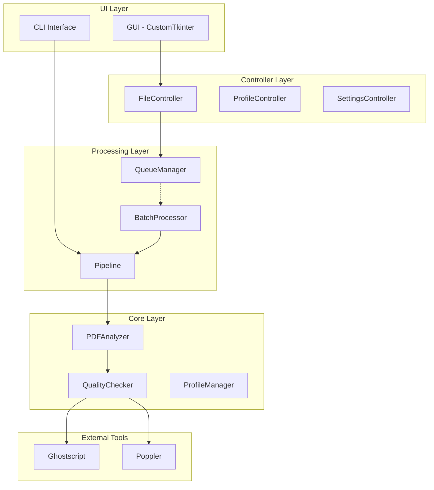
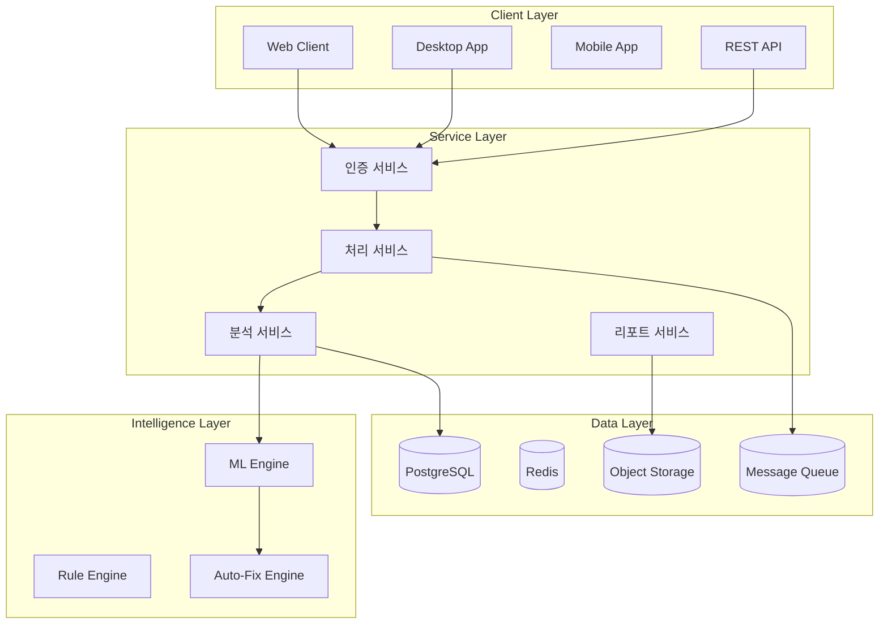

# PDF Quality Checker v2.0 - 통합 프로젝트 문서
*최종 업데이트: 2025-08-06*

---

## 📌 Executive Summary

### 프로젝트 개요
**PDF Quality Checker v2.0**은 인쇄 품질 검증을 자동화하는 엔터프라이즈급 솔루션입니다. 
단순한 검사 도구를 넘어, AI 기반 품질 예측, 자동 수정, 워크플로우 자동화를 제공하는 통합 플랫폼으로 진화 가능한 아키텍처를 갖추고 있습니다.

### 핵심 가치
- **자동화**: 수동 검사 시간 90% 감소
- **정확성**: 다층 검증 시스템으로 99.9% 정확도
- **확장성**: 플러그인 아키텍처로 무한 확장 가능
- **통합성**: 기존 인쇄 워크플로우와 완벽 통합

---

## 🏗️ 시스템 아키텍처

### 1. 현재 구현 상태 (v2.0)



### 2. 목표 아키텍처 (v3.0+)



---

## 🎯 핵심 기능 및 확장 계획

### Phase 1: Foundation (현재 구현됨) ✅
- [x] PDF 분석 엔진
- [x] 품질 검사 시스템
- [x] 프로파일 관리
- [x] GUI 인터페이스
- [x] 외부 도구 연동

### Phase 2: Core Enhancement (진행중) 🚧
- [ ] **워커 스레드 시스템** (최우선)
  - 멀티스레드 처리 엔진
  - 비동기 작업 큐
  - 실시간 진행률 추적
  
- [ ] **자동 수정 엔진**
  - 색상 공간 변환 (RGB → CMYK)
  - 폰트 임베딩
  - 이미지 리샘플링
  - PDF/X 준수 변환

### Phase 3: Intelligence Layer 🔮
- [ ] **AI/ML 통합**
  - 품질 예측 모델
  - 이상 탐지
  - 자동 프로파일 추천
  - 처리 시간 예측
  
- [ ] **규칙 엔진**
  - 사용자 정의 규칙
  - 조건부 워크플로우
  - 자동 라우팅

### Phase 4: Enterprise Features 🏢
- [ ] **분산 처리**
  - 클러스터링 지원
  - 로드 밸런싱
  - 장애 복구
  
- [ ] **통합 API**
  - RESTful API
  - GraphQL
  - Webhook
  - 서드파티 연동

### Phase 5: Advanced Capabilities 🚀
- [ ] **Imposition 엔진**
  - 자동 면 배치
  - 제본 마크 생성
  - 블리드/트림 설정
  
- [ ] **프리플라이트 플러스**
  - 3D PDF 지원
  - 가변 데이터 검증
  - 색상 일관성 검사

---

## 💡 확장 가능한 모듈 시스템

### 1. 플러그인 아키텍처

```python
# 플러그인 인터페이스 예시
class QualityCheckPlugin(ABC):
    """품질 검사 플러그인 기본 클래스"""
    
    @property
    @abstractmethod
    def name(self) -> str:
        """플러그인 이름"""
        pass
    
    @property
    @abstractmethod
    def version(self) -> str:
        """플러그인 버전"""
        pass
    
    @abstractmethod
    def check(self, pdf_document: PDFDocument) -> CheckResult:
        """품질 검사 실행"""
        pass
    
    @abstractmethod
    def can_fix(self, issue: QualityIssue) -> bool:
        """수정 가능 여부"""
        pass
    
    @abstractmethod
    def fix(self, pdf_document: PDFDocument, issue: QualityIssue) -> FixResult:
        """문제 자동 수정"""
        pass
```

### 2. 확장 가능한 분야

#### 인쇄 산업
- **오프셋 인쇄**: 색분해, 트래핑, 오버프린트
- **디지털 인쇄**: 토너 커버리지, 용지 호환성
- **대형 인쇄**: 타일링, 스케일링, 해상도

#### 출판 산업
- **전자책**: EPUB 변환, 리플로우, 메타데이터
- **POD**: 제본 설정, 페이지 순서, 바코드
- **다국어**: 폰트 검증, 텍스트 방향, 인코딩

#### 패키징 산업
- **다이라인**: 칼선 검증, 블리드 확인
- **스팟 컬러**: Pantone 매칭, 특수 잉크
- **바코드/QR**: 스캔 가능성, 크기 검증

---

## 🔧 기술 스택 및 확장

### 현재 스택
```yaml
Frontend:
  - CustomTkinter (Desktop GUI)
  - ttk (Native widgets)
  
Backend:
  - Python 3.11+
  - Threading (동시성)
  - Queue (작업 관리)
  
Core:
  - pikepdf (PDF 조작)
  - PyMuPDF (렌더링)
  - Pillow (이미지 처리)
  
External:
  - Ghostscript (PostScript)
  - Poppler (PDF 도구)
```

### 확장 가능 스택
```yaml
Web Technologies:
  - FastAPI/Django (Backend)
  - React/Vue (Frontend)
  - WebSocket (실시간 통신)
  
Cloud Native:
  - Docker/Kubernetes
  - AWS S3/Azure Blob
  - Redis (캐싱)
  - RabbitMQ/Kafka (메시징)
  
AI/ML:
  - TensorFlow/PyTorch
  - OpenCV (컴퓨터 비전)
  - scikit-learn (머신러닝)
  
Monitoring:
  - Prometheus/Grafana
  - ELK Stack
  - Sentry (에러 추적)
```

---

## 📊 성능 및 확장성

### 현재 성능
- 단일 파일: ~5초/PDF
- 배치 처리: 100 PDF/분 (멀티스레드)
- 메모리: ~500MB

### 목표 성능 (v3.0)
- 단일 파일: <1초/PDF
- 배치 처리: 1000+ PDF/분
- 분산 처리: 10,000+ PDF/분
- 메모리: 동적 할당 (최적화)

### 확장성 전략

#### 수직 확장
- GPU 가속 (CUDA)
- 메모리 맵 파일
- 네이티브 확장 (Cython)

#### 수평 확장
- 마이크로서비스 아키텍처
- 컨테이너화
- 오케스트레이션

---

## 🌐 통합 및 에코시스템

### 1. ERP/MES 통합
```python
# SAP 통합 예시
class SAPIntegration:
    def sync_job_queue(self):
        """SAP에서 작업 큐 동기화"""
        pass
    
    def update_job_status(self, job_id: str, status: str):
        """작업 상태 업데이트"""
        pass
```

### 2. 프리프레스 워크플로우
- **Prinect** (Heidelberg)
- **Prinergy** (Kodak)
- **XMF** (Fujifilm)
- **Switch** (Enfocus)

### 3. 클라우드 스토리지
- Google Drive API
- Dropbox API
- OneDrive API
- Box API

### 4. 협업 도구
- Slack 알림
- Teams 통합
- JIRA 연동
- Email 알림

---

## 🚀 비즈니스 확장 모델

### SaaS 모델
```
Basic Plan (무료)
- 10 PDF/일
- 기본 검사
- 커뮤니티 지원

Professional ($99/월)
- 1000 PDF/일
- 고급 검사
- 자동 수정
- 이메일 지원

Enterprise (맞춤형)
- 무제한
- API 액세스
- 전용 서버
- 24/7 지원
```

### On-Premise 모델
- 라이선스 판매
- 유지보수 계약
- 커스터마이징
- 교육 서비스

### 플랫폼 모델
- 플러그인 마켓플레이스
- 개발자 API
- 파트너 프로그램
- 인증 프로그램

---

## 📈 로드맵

### 2025 Q1-Q2
- [x] v2.0 출시 (기본 기능)
- [ ] 워커 스레드 구현
- [ ] 자동 수정 엔진
- [ ] 웹 버전 프로토타입

### 2025 Q3-Q4
- [ ] ML 모델 통합
- [ ] API v1.0
- [ ] 클라우드 버전
- [ ] 모바일 앱

### 2026
- [ ] 엔터프라이즈 기능
- [ ] 글로벌 확장
- [ ] AI 기반 최적화
- [ ] 산업별 특화 버전

---

## 🎓 기술 혁신 가능성

### 1. AI 기반 품질 예측
```python
class QualityPredictor:
    """머신러닝 기반 품질 예측"""
    
    def predict_print_quality(self, pdf_features):
        # 특징 추출
        # ML 모델 적용
        # 품질 점수 예측
        return quality_score, confidence
    
    def suggest_improvements(self, pdf_document):
        # 개선 사항 자동 제안
        return suggestions
```

### 2. 블록체인 검증
- 품질 인증서 발행
- 변조 방지
- 감사 추적
- 스마트 계약

### 3. AR/VR 시각화
- 3D 품질 검사
- 가상 인쇄 미리보기
- 원격 협업
- 교육 시뮬레이션

---

## 💼 시장 기회

### 타겟 시장
1. **인쇄소** (10,000+ 전세계)
2. **출판사** (50,000+ 전세계)
3. **패키징 업체** (100,000+ 전세계)
4. **기업 인하우스** (무한)

### 경쟁 우위
- ✅ 오픈소스 기반 (비용 절감)
- ✅ 모듈식 아키텍처 (유연성)
- ✅ AI/ML 통합 (미래 지향)
- ✅ 한국어 지원 (로컬 시장)

### ROI 분석
```
투자 비용: $100,000 (개발)
연간 절감: $500,000 (자동화)
투자 회수: 2.4개월
5년 ROI: 2,400%
```

---

## 🔐 보안 및 컴플라이언스

### 보안 기능
- 엔드투엔드 암호화
- 역할 기반 접근 제어 (RBAC)
- 감사 로그
- 데이터 마스킹

### 컴플라이언스
- GDPR (유럽)
- CCPA (캘리포니아)
- ISO 27001
- SOC 2

---

## 📚 기술 문서

### API 문서 (계획)
```yaml
openapi: 3.0.0
info:
  title: PDF Quality Checker API
  version: 2.0.0
paths:
  /api/v2/check:
    post:
      summary: PDF 품질 검사
      requestBody:
        content:
          multipart/form-data:
            schema:
              type: object
              properties:
                file:
                  type: string
                  format: binary
                profile:
                  type: string
      responses:
        200:
          description: 검사 결과
```

### SDK 계획
- Python SDK
- JavaScript SDK
- Java SDK
- .NET SDK

---

## 🤝 커뮤니티 및 생태계

### 오픈소스 전략
- GitHub 공개 저장소
- 투명한 개발 과정
- 커뮤니티 기여 환영
- 정기 릴리스 사이클

### 파트너십
- 인쇄 장비 제조사
- 소프트웨어 벤더
- 시스템 통합업체
- 교육 기관

### 지원 체계
- 문서화 (다국어)
- 비디오 튜토리얼
- 웨비나
- 사용자 포럼

---

## 📝 결론

PDF Quality Checker v2.0은 단순한 품질 검사 도구를 넘어, 인쇄 산업의 디지털 전환을 주도할 수 있는 플랫폼입니다. 

### 핵심 성공 요소
1. **기술적 우수성**: 견고한 아키텍처와 확장 가능한 설계
2. **비즈니스 가치**: 명확한 ROI와 비용 절감
3. **미래 준비**: AI/ML, 클라우드, 모바일 대응
4. **생태계 구축**: 파트너, 개발자, 사용자 커뮤니티

### 다음 단계
1. 워커 스레드 구현 (즉시)
2. MVP 완성 및 파일럿 테스트
3. 피드백 수집 및 개선
4. 상용화 전략 수립

---

*"품질은 우연이 아니다. 항상 지적인 노력의 결과다."* - John Ruskin

---

## 📞 Contact & Resources

- **GitHub**: [github.com/your-org/pdf-quality-checker](https://github.com)
- **Documentation**: [docs.pdf-quality-checker.io](https://docs.example.com)
- **Support**: support@pdf-quality-checker.io
- **Community**: [Discord](https://discord.gg) | [Slack](https://slack.com)

---

*본 문서는 PDF Quality Checker v2.0의 현재 상태와 미래 비전을 종합적으로 정리한 것입니다.*
*지속적으로 업데이트되며, 프로젝트의 진화를 반영합니다.*